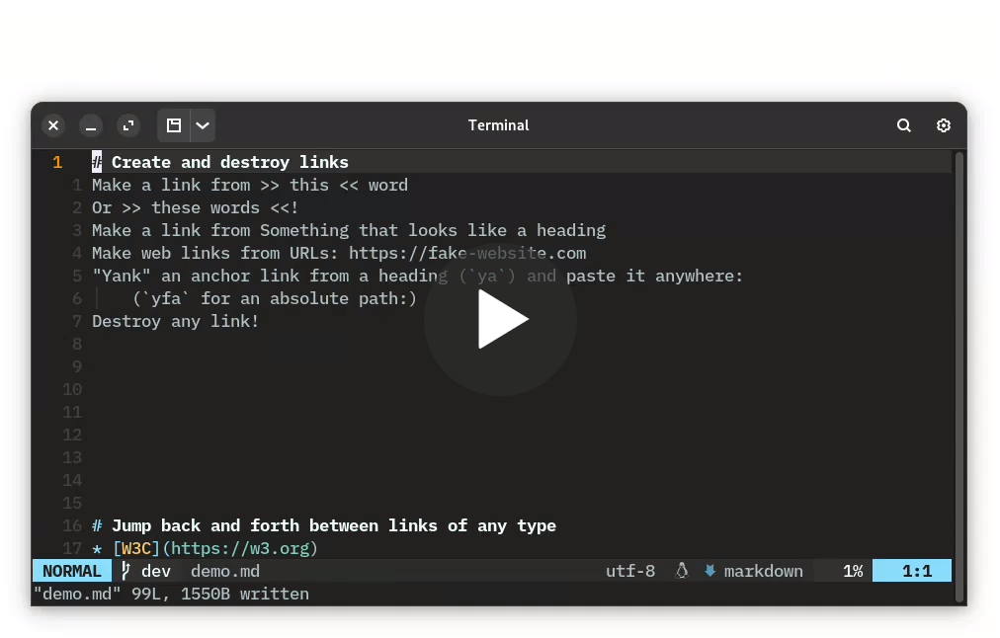

<p align=center>

</p>
<p align=center></p>
<p align=center>
   <a href="#-features">Features</a> / <a href="#-installation">Installation</a> / <a href="#-starting-a-notebook">Starting a notebook</a> / <a href="#%EF%B8%8F-configuration">Config</a> / <a href="#-commands-and-default-mappings">Commands & mappings</a> / <a href="#%EF%B8%8F-to-do">To do</a> / <a href="#-recent-changes">Recent changes</a> / <a href="#-links">Links</a>
</p>

<div style="margin-left: 5em; margin-right: 5em;">
<p align=center>
    🆕<strong>Latest features</strong>🆕
</p>
<ol>
    <li><a href="#create-customize-and-destroy-links">Creating and jumping to bracketed spans</a></li>
    <li><a href="#-disable-unused-modules">Individually disable modules you don't plan to use</a></li>
    <li><a href="#section-folding">Intuitively fold sections defined by headings</li>
</ol>
<p>
See <a href="#-recent-changes">Recent changes</a> for a complete list of major and minor changes
</p>
</div>

## 📝 Description

Mkdnflow is designed for the *fluent* navigation of documents and notebooks (AKA "wikis") written in [markdown](https://markdownguide.org). The plugin's [flexibility](#customizable-link-interpretation) and its prioritization of markdown also means it can become part of your webdev workflow if you use static site generators like Jekyll or Hugo, which can generate static sites from markdown documents.

The plugin is an extended set of functions and mappings to those functions which make it easy to navigate and manipulate markdown documents and notebooks in Neovim. I originally started writing Mkdnflow to replicate some features from [Vimwiki](https://github.com/vimwiki/vimwiki) in Lua instead of Vimscript, but my current goal for this project is to make this plugin as useful as possible for anyone using Neovim who maintains a set of markdown notes and wishes to efficiently navigate those notes and keep them organized and connected. The plugin now includes some convenience features I wished Vimwiki had, including functionality to [rename the source part of a link and its associated file](#rename-link-sources-and-files-simultaneously) simultaneously.

I keep tabs on the project's [issues](https://github.com/jakewvincent/mkdnflow.nvim/issues) and appreciate feature requests, suggestions, and bug reports. If you'd like to contribute to the plugin, fork this repo and submit a [pull request](https://github.com/jakewvincent/mkdnflow.nvim/pulls) with your changes or additions. If you need Lua resources, see [this page](https://neovim.io/doc/lua-resources/) for a starting point or run `:h lua` or `:h api` in Neovim.

### ⚡ Requirements

* Linux, macOS, or Windows
* Neovim >= 0.7.0 for all functionality (most will work with Neovim >= 0.5.0, but mappings will need to be set separately)
* Optional: If you wish to use UTF-8 symbols as [custom to-do symbols](#to_do-dictionary-like-table) or in [tables that you wish to have Mkdnflow format](#tables-dictionary-like-table), you'll need the luarocks module [`luautf8`](https://luarocks.org/modules/xavier-wang/luautf8). Luarocks dependencies can be installed via [Packer](#initlua) using the `rocks` key:

```lua
use({'jakewvincent/mkdnflow.nvim',
    rocks = 'luautf8', -- Ensures optional luautf8 dependency is installed
    config = function()
        require('mkdnflow').setup({})
    end
})
```

### ➖ Differences from [Vimwiki](https://github.com/vimwiki/vimwiki)

* Vimwiki doesn't use markdown by default; mkdnflow only works for markdown
* I'm intending mkdnflow to be a little lighter weight/less involved than Vimwiki. Mkdnflow doesn't and won't provide syntax highlighting and won't create new filetypes (although it now optionally provides link concealing, since this was a requested feature).
* Mkdnflow allows you to [prevent modules from being loaded](#modules-dictionary-like-table) that provide features you don't want or don't expect to use (all are enabled by default)
    * Mappings to user commands associated with these modules will not be defined if the command depends on a module that is not loaded
* Written in Lua

## ✨ Features

<p align=center>
<a href="https://user-images.githubusercontent.com/45184202/166573700-62cdec3b-a13f-4f9e-9d72-ab2650205042.mp4"></a>
</p>

### Two link styles
* Use either markdown or wiki-link link styles by setting a [config option](#link_style-string).
* 🆕 Conceal link sources for either link type by enabling conceal in [your config](#-configuration)
    * Markdown-style links are shortened from `[Link](source.md)` to `Link`
    * Wiki-style links are shortened from `[[source|Link]]` to `Link` or from `[[source]]` to `source`
    * NOTE: If you are using the [recently split treesitter parsers for markdown](https://github.com/nvim-treesitter/nvim-treesitter#supported-languages), you do not need to enable conceal through mkdnflow--if you are using markdown-style links. Just make sure you have `markdown` and `markdown_inline` installed and enabled in markdown filetypes, and in your `.vimrc` or `init.lua`, enable conceal (`set conceallevel=2` or `vim.wo.conceallevel = 2`).

### Follow links and citations
* `<CR>` on various kinds of links to "follow" them:
    * `.md` links open in the current window
    * Absolute links or `.md` links relative to home open in the current window but are interpreted with absolute perspective (e.g. `[File](/home/user/file.md)`/`[File](C:\Users\user\file.md)` on Windows, or `[File](~/Documents/file.md)`)
    * Links to a file prefixed with `file:` (e.g. `[My Xournal notes](file:notes.xopp)`) open with the system's default program for that filetype
    * Link to URLs are opened in the default browser
    * Anchor links to headings in the current file will trigger a jump to that heading. Headings must start with a hash, and the path part of the link must look like the heading with (a) any spaces between the last hash mark and the beginning of the heading text removed, (b) all other spaces converted to a dash, (c) non-alphanumeric characters removed, (d) strings of multiple hashes converted into a single hash, and (e) all upper-case characters converted to lower-case characters. For example:
        * `## Bills to pay` will be jumped to if the path in the anchor link is `#bills-to-pay`
        * `#### Groceries/other things to buy` will be jumped to if the path in the anchor link is `#groceriesother-things-to-buy`
    * Following a link to a directory (e.g. another notebook) will open a dialogue for you to select which file in the directory to open in the current window
* `<CR>` on citations to open associated files or websites (e.g. `@Chomsky1957`, with or without brackets around it)
    * Specify a path to a [.bib](http://www.bibtex.org/Format/) file in [your config](#default_path-string)—or if `perspective.priority` is `root`, simply place your bib files to be searched in your notebook's root directory.
    * Files are prioritized. If no file is found associated with the citation key, a URL associated with it will be opened. If no URL is found, a DOI is opened. If no DOI is found, whatever is in the `howpublished` field is opened.
    * 🔥 Hot tip: make reaching your contacts via work messaging apps (e.g. Slack) easier by keeping a bib file that associates your contacts' messaging handles with the URL for your direct message thread with that contact. For instance, if you [point the plugin to a bib file](#default_bib_path-string) with the following entry, `<CR>`ing on `@dschrute` in a markdown document would take you to the associated Slack thread.

```bib
@misc{dschrute,
    url={https://dundermifflin.slack.com/archives/P07BFJD82}
}
```

### Customizable link interpretation
* Specify what perspective the plugin-should take when interpreting links to files. There are [three options](#perspective-dictionary-like-table):
    1. Interpret links relative to the first-opened file (default behavior; similar to #3 if your first-opened file is always in the root directory)
    2. Interpret links relative to the file open in the current buffer
    3. Interpret links relative to the root directory of the notebook that the file in the current buffer is a part of. To enable this functionality, set `perspective.priority` to `root` in your config, and pass a file as the value of `perspective.root_tell`. The _tell_ is the name of a single file that can be used to identify the root directory (e.g. `index.md`, `.git`, `.root`, `.wiki_root`, etc.). See [the default config](#%EF%B8%8F-configuration) for how to configure the `perspective` table.
    * Override any of the above settings by specifying a link to a markdown file with an absolute path (one that starts with `/` or `~/`). Links within this file will still receive the relative interpretation, so this is best for references out of the project directory to markdown files without their own dependencies (unless those dependencies are within the project directory).
* Keep your files organized **and** your links simple by customizing link interpretation using an [implicit transformation function](#links-dictionary-like-table).

### Create, customize, and destroy links
* `<CR>` on word under cursor or visual selection to create a notebook-internal link
    * Customizable path text transformations (by default, text is converted to lowercase, spaces are converted to dashes, and the date in YYYY-MM-DD format is prefixed to the filename, separated by an underscore). See the description of the [`links`](#links-dictionary-like-table) config key for customization instructions.
* `<M-CR>` (Alt-Enter) when your cursor is anywhere in a link to destroy it (replace it with the text in [...])
* Create an anchor link if the visual selection starts with `#` 
* 🆕 Tag visually selected spans of text (mapped to `<M-CR>` in visual mode) using the style specified in the [Pandoc `bracketed_spans` extension](https://pandoc.org/MANUAL.html#extension-bracketed_spans) (ID must be assigned with the ID selector---i.e. `#`): `[This is a span]{#important-span}`.
* Create a web link if what's under the cursor is a URL (and move the cursor to enter the link name)
* `ya` on a heading (🆕 or bracketed span) to add a formatted anchor link for the heading to the default register (ready to paste in the current window)
    * `yfa` to do the same, but adding the absolute path of the file before the anchor (for pasting in another buffer)
* Customize how link sources are generated from text using a custom explicit transformation function
    * Adding the following to your setup would result in a link that looks like the following: `[Some text the link was created from](sometextthelinkwascreatedfrom.md)`

```lua
require('mkdnflow').setup({
    links = {
        transform_explicit = function(text)
            -- Make lowercase, remove spaces, and reverse the string
            return string.lower(text:gsub(' ', '')
        end
    }
})
```

### Jump to links, headings
* `<Tab>` and `<S-Tab>` jump to the next and previous links in the file
* `]]` and `[[` jump to the next and previous headings in the file
* "Wrap" back to the beginning/end of the file when jumping with a [config setting](#wrap-boolean)

### Create missing directories
* If a link goes to a file in a directory that doesn't exist, it can optionally [be created](#create_dirs-boolean)

### Rename link sources and files simultaneously
* Use built-in dialog triggered by `MkdnMoveSource` (mapped to `<F2>` by default) to rename a link's source *and rename/move the linked file* simultaneously
    * [Perspective](#customizable-link-interpretation), [implicit extensions](#links-dictionary-like-table), and custom [implicit transformations](#links-dictionary-like-table) are all taken into account when moving the linked file
    * The dialog will confirm the details of the changes for you to approve/reject before taking any action

### Backward and forward navigation through buffers
* `<BS>` to go **backward** (to the previous file/buffer opened in the current window, like clicking the back button in a web browser)
* `<Del>` to go **forward** (to the subsequent file/buffer opened in the current window, like clicking the forward button in a web browser)

### Keybindings
* Easy-to-remember [default keybindings](#-commands-and-default-mappings) that activate only in markdown files (and/or other filetypes you specify in the `filetypes` config table)
* [Customize keybindings](#mappings-dictionary-like-table) individually or [disable them altogether](#modules-dictionary-like-table) by disabling the `maps` module)

### Manipulate headings
* Increase/decrease heading levels (mapped to `+`/`-` by default). **Note**: *Increasing* the heading means increasing it in importance (i.e. making it bigger or more prominent when converted to HTML and rendered in a browser), which counterintuitively means *removing* a hash symbol.

### Section folding
* 🆕 Fold a section using `<CR>` in normal mode if the cursor is on the heading of the section
    * Unfold a folded section using `<CR>` or `<leader>F` (both are default mappings; the former maps to a wrapper function that will follow links if the cursor is not on a fold or section heading; the latter is mapped specifically to `:MkdnUnfoldSection<CR>`)
    * If you wish to create a link in a heading (normally done with `<CR>`), you'll need to do so by making a visual selection of the text you wish to create a link from and then hitting `<CR>`, or otherwise disabling the mapping for `MkdnEnter` and mapping `MkdnFollowLink` to `<CR>` in visual and normal modes.
* 🆕 Fold the section the cursor is currently in—even if the cursor is not on the heading—using `<leader>f`

### Lists
* Toggle the status of a to-do list item on the current line (mapped to `<C-Space>` by default). Using the default settings, toggling will result in the following changes. To-do symbols [can be customized](#to_do-dictionary-like-table) (make sure to use the [luautf8 luarock dependency](#if-you-wish-to-use-custom-utf-8-to-do-symbols-add-the-luautf8-luarock-dependency) if you want to use utf8 to-do symbols).
    * `* [ ] ...` → `* [-] ...`
    * `* [-] ...` → `* [X] ...`
    * `* [X] ...` → `* [ ] ...`
* Toggle multiple to-do items at once by selecting the lines to toggle in (simple) visual mode (mapped to `<C-Space>` by default)
* Create to-do items from plain unordered or ordered lists by toggling a non-to-do-list item (`<C-Space>` by default)
* Automatically update any parent to-dos when child to-dos are toggled.
    * When all child to-dos have been marked complete, the parent is marked complete
    * When at least one child to-do has been marked in-progress, the parent to-do is marked in-progress
    * When a parent to-do is marked complete and one child to-do is reverted to not-yet-started or in-progress, the parent to-do is marked in-progress
    * When a parent to-do is marked complete or in-progress and all child to-dos have been reverted to not-yet-started, the parent to-do is marked not-yet-started.
* Update numbering for the list the cursor is currently on
    * `<leader>nn` (default mapping) or `:MkdnUpdateNumbering 0<CR>`, e.g., if you want to start numbering at 0
* Smart(er) behavior when `<CR>`ing in lists (NOTE: currently not enabled by default. See below.)
    * NOTE: The following functionality is disabled by default in case some find it intrusive. To enable the functionality, remap `<CR>` in insert mode (see the following code block).
    * In unordered lists: Add another bullet on the next line, unless the current list item is empty, in which case it will be erased
    * In ordered lists: Add another item on the next line (keeping numbering updated), unless the current item is empty, in which case it will be erased
    * In unordered and ordered to-do lists: Add another to-do item on the next line, unless the current to-do is empty, in which case it will be replaced with a simple (non-to-do) list item
    * Automatically indent a new list item when the current one ends in a colon
    * Demote empty indented list items by reducing the indentation by one level
* Add new list items using the list type of the current line without any of the fancy stuff listed above (see [MkdnExtendList](#-commands-and-default-mappings))

```lua
require('mkdnflow').setup({
    mappings = {
        MkdnEnter = {{'i', 'n', 'v'}, '<CR>'} -- This monolithic command has the aforementioned insert-mode-specific behavior and also will trigger row jumping in tables. Outside of lists and tables, it behaves as <CR> normally does.
        -- MkdnNewListItem = {'i', '<CR>'} -- Use this command instead of you only want <CR> in insert mode to add a new list item (and behave as usual outside of lists)
    }
})
```

### Tables
* 🆕 Create a markdown table of `x` columns and `y` rows with `:MkdnTable x y`. Table headers are added automatically; to exclude headers, use `:MkdnTable x y noh`
* 🆕 Format existing tables with `:MkdnTableFormat`
    * Make sure you have the `luautf8` rock installed if you want to format tables containing non-ascii symbols!
* 🆕 Jump forward and backward between cells (mapped to `<Tab>` and `<S-Tab>` in insert mode by default)
* 🆕 Jump forward and backward between rows (the latter is mapped to `<M-CR>` in insert mode by default; jumping forward is not mapped to anything by default; see `MkdnEnter` or `MkdnTableNextRow` in [default mappings](#-commands-and-default-mappings))
* 🆕 Optionally trim extra whitespace from a cell when formatting (see [config options](#-configuration))
* 🆕 Optionally disable formatting when moving cells
* 🆕 Add new rows or columns (before or after the current row/cell; see [default mappings](#-commands-and-default-mappings))

<p align=center><strong>More coming soon! I use this plugin daily for work have been regularly adding new features for my use cases. Please share ideas and feature requests by <a href="https://github.com/jakewvincent/mkdnflow.nvim/issues">creating an issue</a>.</strong></p>

### 🆕 Disable unused modules
* Individually disable any of the modules that enable all of the above functionality (see [`modules` config option descriptions](#modules-dictionary-like-table))
    * Prevents the module from being loaded (rather than simply disabling the functionality the module provides)
    * Disabling a module prevents mappings to commands that are dependent on that module from being defined

## 📦 Installation and usage

### init.lua
<details>
<summary>Install with Packer</summary><p>

```lua
use({'jakewvincent/mkdnflow.nvim',
     config = function()
        require('mkdnflow').setup({
            -- Config goes here; leave blank for defaults
        })
     end
})
```

#### If you wish to use custom UTF-8 to-do symbols, add the luautf8 luarock dependency

```lua
use({'jakewvincent/mkdnflow.nvim',
     rocks = 'luautf8',
     config = function()
        require('mkdnflow').setup({
            -- Config goes here; leave blank for defaults
        })
     end
})
```

</p></details>

<details>
<summary>Install with Paq</summary><p>

```lua
require('paq')({
    -- Your other plugins;
    'jakewvincent/mkdnflow.nvim';
    -- Your other plugins;
})

-- Include the setup function somewhere else in your init.lua/vim file, or the
-- plugin won't activate itself:

require('mkdnflow').setup({
    -- Config goes here; leave blank for defaults
})
```

</p></details>

### init.vim
<details>
<summary>Install with Vim-Plug, NeoBundle, Vundle, Pathogen, or Dein</summary><p>

```vim
" Vim-Plug
Plug 'jakewvincent/mkdnflow.nvim'

" NeoBundle
NeoBundle 'jakewvincent/mkdnflow.nvim'

" Vundle
Bundle 'jakewvincent/mkdnflow.nvim'

" Pathogen
git clone https://github.com/jakewvincent/mkdnflow.nvim.git ~/.vim/bundle/mkdownflow.nvim

" Dein
call dein#add('jakewvincent/mkdnflow.nvim')

" Include the setup function somewhere else in your init.vim file, or the
" plugin won't activate itself:
lua << EOF
require('mkdnflow').setup({
    -- Config goes here; leave blank for defaults
})
EOF
```

</p></details>

### ❗ Caveats/warnings

All functionality of the plugin should now work on all operating systems, including Windows! However, since I don't use Windows on my daily driver, there may be edge cases that cause trouble. Please file an issue if anything comes up.

### 🏁 Starting a notebook

As long as you successfully installed Mkdnflow, you don't need to do anything special to start using the plugin. All of the plugin's features will be enabled for any markdown file (or for any filetype you specify under the `filetypes` config key). If you would like to start a notebook (AKA "wiki"), first create a directory for it. If you're using Neovim in the terminal, simply enter `nvim index.md` and start writing. I suggest using `index.md` as a landing page/table of contents that contains links to all other notes in your notebook. If you use such a landing page, try setting `perspective.priority` in your Mkdnflow config to `'root'` and your `perspective.root_tell` to `'index.md'` so that Mkdnflow can identify your notebook's root directory and reliably interpret links relative to this directory.

## ⚙️ Configuration

Currently, the setup function uses the defaults shown below. See the descriptions and non-default options in the [section below the following block](#config-descriptions). **To use these defaults, simply pass no arguments setup function:** `require('mkdnflow').setup()`. To change these settings, specify new values for any of them them in the setup function.

```lua
-- ** DEFAULT SETTINGS; TO USE THESE, PASS NO ARGUMENTS TO THE SETUP FUNCTION **
require('mkdnflow').setup({
    modules = {
        bib = true,
        buffers = true,
        conceal = true,
        cursor = true,
        folds = true,
        links = true,
        lists = true,
        maps = true,
        paths = true,
        tables = true
    },
    filetypes = {md = true, rmd = true, markdown = true},
    create_dirs = true,             
    perspective = {
        priority = 'first',
        fallback = 'current',
        root_tell = false,
        nvim_wd_heel = true
    },    
    wrap = false,
    bib = {
        default_path = nil,
        find_in_root = true
    },
    silent = false,
    links = {
        style = 'markdown',
        conceal = false,
        implicit_extension = nil,
        transform_implicit = false,
        transform_explicit = function(text)
            text = text:gsub(" ", "-")
            text = text:lower()
            text = os.date('%Y-%m-%d_')..text
            return(text)
        end
    },
    to_do = {
        symbols = {' ', '-', 'X'},
        update_parents = true,
        not_started = ' ',
        in_progress = '-',
        complete = 'X'
    },
    tables = {
        trim_whitespace = true,
        format_on_move = true
    },
    mappings = {
        MkdnEnter = {{'n', 'v'}, '<CR>'},
        MkdnTab = false,
        MkdnSTab = false,
        MkdnNextLink = {'n', '<Tab>'},
        MkdnPrevLink = {'n', '<S-Tab>'},
        MkdnNextHeading = {'n', ']]'},
        MkdnPrevHeading = {'n', '[['},
        MkdnGoBack = {'n', '<BS>'},
        MkdnGoForward = {'n', '<Del>'},
        MkdnFollowLink = false, -- see MkdnEnter
        MkdnDestroyLink = {'n', '<M-CR>'},
        MkdnTagSpan = {'v', '<M-CR>'},
        MkdnMoveSource = {'n', '<F2>'},
        MkdnYankAnchorLink = {'n', 'ya'},
        MkdnYankFileAnchorLink = {'n', 'yfa'},
        MkdnIncreaseHeading = {'n', '+'},
        MkdnDecreaseHeading = {'n', '-'},
        MkdnToggleToDo = {{'n', 'v'}, '<C-Space>'},
        MkdnNewListItem = false,
        MkdnExtendList = false,
        MkdnUpdateNumbering = {'n', '<leader>nn'},
        MkdnTableNextCell = {'i', '<Tab>'},
        MkdnTablePrevCell = {'i', '<S-Tab>'},
        MkdnTableNextRow = false,
        MkdnTablePrevRow = {'i', '<M-CR>'},
        MkdnTableNewRowBelow = {{'n', 'i'}, '<leader>ir'},
        MkdnTableNewRowAbove = {{'n', 'i'}, '<leader>iR'},
        MkdnTableNewColAfter = {{'n', 'i'}, '<leader>ic'},
        MkdnTableNewColBefore = {{'n', 'i'}, '<leader>iC'},
        MkdnFoldSection = {'n', '<leader>f'},
        MkdnUnfoldSection = {'n', '<leader>F'}
    }
})
```

### Config descriptions
#### `modules` (dictionary-like table)
* All modules are enabled by default:
    * `modules.bib` (required for [parsing bib files](#follow-links-and-citations) and [following citations](#follow-links-and-citations))
    * `modules.buffers` (required for [backward and forward navigation through buffers](#backward-and-forward-navigation-through-buffers))
    * `modules.conceal` (required if you wish to enable [link concealing](#two-link-styles); note that you must declare [`links.conceal` as `true`](#links-dictionary-like-table) in addition to enabling this module if you wish to conceal links)
    * `modules.cursor` (required for [jumping to links and headings](#jump-to-links-headings); [yanking anchor links](#create-customize-and-destroy-links))
    * `modules.folds` (required for [folding by section](#section-folding))
    * `modules.links` (required for [creating and destroying links](#create-customize-and-destroy-links) and [following links](#follow-links-and-citations))
    * `modules.lists` (required for [manipulating lists, toggling to-do list items, etc.](#lists))
    * `modules.maps` (required for [setting mappings via the mappings table](#keybindings); set to `false` if you wish to set mappings outside of the plugin)
    * `modules.paths` (required for [link interpretation](#customizable-link-interpretation) and [following links](#follow-links-and-citations))
    * `modules.tables` (required for [table navigation and formatting](#tables))

#### `create_dirs` (boolean)
* `true`: Directories referenced in a link will be (recursively) created if they do not exist
* `false` No action will be taken when directories referenced in a link do not exist. Neovim will open a new file, but you will get an error when you attempt to write the file.

#### `perspective` (dictionary-like table)
* `perspective.priority` (string): Specifies the priority perspective to take when interpreting link paths
    * `'first'`: Links will be interpreted relative to the first-opened file (when the current instance of Neovim was started)
    * `'current'`: Links will be interpreted relative to the current file
    * `'root'`: Links will be interpreted relative to the root directory of the current notebook (requires `perspective.root_tell` to be specified)
    * `'nvim_wd_heel'`: Changes in perspective will be reflected in the nvim working directory. (In other words, the working directory will "heel" to the plugin's perspective.) This helps ensure (at least) that path completions (if using a completion plugin with support for paths) will be accurate and usable.
* `perspective.fallback` (string): Specifies the backup perspective to take if priority isn't possible (e.g. if it is `'root'` but no root directory is found)
    * `'first'`: (see above)
    * `'current'`: (see above)
    * `'root'`: (see above)
* `perspective.root_tell` (string or boolean)
    * `'<any file name>'`: Any arbitrary filename by which the plugin can uniquely identify the root directory of the current notebook. If `false` is used instead, the plugin will never search for a root directory, even if `perspective.priority` is set to `root`.

#### `filetypes` (dictionary-like table)
* `<any arbitrary filetype extension>` (boolean value)
    * `true`: A matching extension will enable the plugin's functionality for a file with that extension

Note: This functionality references the file's extension. It does not rely on Neovim's filetype recognition. The extension must be provided in lower case because the plugin converts file names to lowercase. Any arbitrary extension can be supplied. Setting an extension to `false` is the same as not including it in the list.

#### `wrap` (boolean)
* `true`: When jumping to next/previous links or headings, the cursor will continue searching at the beginning/end of the file
* `false`: When jumping to next/previous links or headings, the cursor will stop searching at the end/beginning of the file

#### `bib` (dictionary-like table)
* `bib.default_path` (string or `nil`): Specifies a path to a default .bib file to look for citation keys in (need not be in root directory of notebook)
* `bib.find_in_root` (boolean)
    * `true`: When `perspective.priority` is also set to `root` (and a root directory was found), the plugin will search for bib files to reference in the notebook's top-level directory. If `bib.default_path` is also specified, the default path will be appended to the list of bib files found in the top level directory so that it will also be searched.
    * `false`: The notebook's root directory will not be searched for bib files.

#### `silent` (boolean)
* `true`: The plugin will not display any messages in the console except compatibility warnings related to your config
* `false`: The plugin will display messages to the console (all messages from the plugin start with ⬇️ )

#### `links` (dictionary-like table)
* `links.style` (string)
    * `'markdown'`: Links will be expected in the standard markdown format: `[<title>](<source>)`
    * `'wiki'`: Links will be expected in the unofficial wiki-link style, specifically the [title-after-pipe format](https://github.com/jgm/pandoc/pull/7705): `[[<source>|<title>]]`.
* `links.conceal` (boolean)
    * `true`: Link sources and delimiters will be concealed (depending on which link style is selected)
    * `false`: Link sources and delimiters will not be concealed by mkdnflow
* `links.implicit_extension` (string)
    * `<any extension>`: A string that instructs the plugin (a) how to _interpret_ links to files that do not have an extension, and (b) that new links should be created without an explicit extension
* `links.transform_explicit` (function or `false`): A function that transforms the text to be inserted as the source/path of a link when a link is created. Anchor links are not currently customizable. If you want all link paths to be explicitly prefixed with the year, for instance, and for the path to be converted to uppercase, you could provide the following function under this key. (FYI: The previous functionality specified under the `prefix` key has been migrated here to provide greater flexibility.)

```lua
function(input)
    return(string.upper(os.date('%Y-')..input))
end
```

* `links.transform_implicit` (function or `false`): A function that transforms the path of a link immediately before interpretation. It does not transform the actual text in the buffer but can be used to modify link interpretation. For instance, link paths that match a date pattern can be opened in a `journals` subdirectory of your notebook, and all others can be opened in a `pages` subdirectory, using the following function:

```lua
function(input)
    if input:match('%d%d%d%d%-%d%d%-%d%d') then
        return('journals/'..input)
    else
        return('pages/'..input)
    end
end
```

#### `to_do` (dictionary-like table)
* `to_do.symbols` (array-like table): A list of symbols (each no more than one character) that represent to-do list completion statuses. `MkdnToggleToDo` references these when toggling the status of a to-do item. Three are expected: one representing not-yet-started to-dos (default: `' '`), one representing in-progress to-dos (default: `-`), and one representing complete to-dos (default: `X`).
    * NOTE: Native Lua support for UTF-8 characters is limited, so in order to ensure all functionality works as intended if you are using non-ascii to-do symbols, you'll need to install the luarocks module "luautf8".
* `to_do.update_parents` (boolean): Whether parent to-dos' statuses should be updated based on child to-do status changes performed via `MkdnToggleToDo`
    * `true` (default): Parent to-do statuses will be inferred and automatically updated when a child to-do's status is changed
    * `false`: To-do items can be toggled, but parent to-do statuses (if any) will not be automatically changed
* The following entries can be used to stipulate which symbols shall be used when updating a parent to-do's status when a child to-do's status is changed. These are **not required**: if `to_do.symbols` is customized but these options are not provided, the plugin will attempt to infer what the meanings of the symbols in your list are by their order. For example, if you set `to_do.symbols` as `{' ', '⧖', '✓'}`, `' '` will be assiged to `to_do.not_started`, '⧖' will be assigned to `to_do.in_progress`, etc. If more than three symbols are specified, the first will be used as `not_started`, the second will be used as `in_progress`, and the last will be used as `complete`. If two symbols are provided (e.g. `' ', '✓'`), the first will be used as both `not_started` and `in_progress`, and the second will be used as `complete`.
    * `to_do.not_started` (string): Stipulates which symbol represents a not-yet-started to-do
    * `to_do.in_progress` (string):  Stipulates which symbol represents an in-progress to-do
    * `to_do.complete` (string):  Stipulates which symbol represents a complete to-do

#### `tables` (dictionary-like table)
* `tables.trim_whitespace` (boolean): Whether extra whitespace should be trimmed from the end of a table cell when a table is formatted (default: `true`)
* `tables.format_on_move` (boolean): Whether tables should be formatted each time the cursor is moved via MkdnTable{Next/Prev}{Cell/Row} (default: `true`)

Note: See [default mappings](#-commands-and-default-mappings)

#### `mappings` (dictionary-like table)
* `mappings.<name of command>` (array-like table or `false`)
    * `mappings.<name of command>[1]` string or array table representing the mode (or array of modes) that the mapping should apply in (`'n'`, `'v'`, etc.)
    * `mappings.<name of command>[2]` string representing the keymap (e.g. `'<Space>'`)
    * set `mappings.<name of command> = false` to disable default mapping without providing a custom mapping

Note: `<name of command>` should be the name of a commands defined in `mkdnflow.nvim/plugin/mkdnflow.lua` (see :h Mkdnflow-commands for a list).

### 👍 Recommended vim settings

I recommended turning on `autowriteall` in Neovim *for markdown filetypes*. This will ensure that changes to buffers are saved when you navigate away from that buffer, e.g. by following a link to another file. See `:h awa`.

```lua
-- If you have an init.lua
vim.cmd('autocmd FileType markdown set autowriteall')
```

```vim
" If you have an init.vim
autocmd FileType markdown set autowriteall
```

### ❕ Commands and default mappings

These default mappings can be disabled; see [Configuration](#%EF%B8%8F-configuration). Commands with no mappings trigger functions that are called by the functions with mappings, but I've given them a command name so you can use them as independent functions if you'd like to.

| Keymap       | Mode      | Command                       | Description                                                                                                                                                                                                                                                                                                                                                                                                                                                                                                                                                                                                                                                                         |
| ------------ | --------- | ----------------------------- | ----------------------------------------------------------------------------------------------------------------------------------------------------------------------------------------------------------------------------------------------------------------------------------------------------------------------------------------------------------------------------------------------------------------------------------------------------------------------------------------------------------------------------------------------------------------------------------------------------------------------------------------------------------------------------------- |
| `<CR>`       | n, v(, i) | `:MkdnEnter<CR>`              | Triggers a wrapper function which will (a) infer your editor mode, and then if in normal or visual mode, either follow a link, create a new link from the word under the cursor or visual selection, or fold a section (if cursor is on a section heading); if in insert mode, it will create a new list item (if cursor is in a list), go to the next row in a table (if cursor is in a table), or behave normally (if cursor is not in a list or a table) NOTE: There is no insert-mode mapping for this command by default since some may find its effects intrusive. To enable the insert-mode functionality, add to the mappings table: `MkdnEnter = {{'i', 'n', 'v'}, '<CR>}` |
| `<Tab>`      | n         | `:MkdnNextLink<CR>`           | Move cursor to the beginning of the next link (if there is a next link)                                                                                                                                                                                                                                                                                                                                                                                                                                                                                                                                                                                                             |
| `<S-Tab>`    | n         | `:MkdnPrevLink<CR>`           | Move the cursor to the beginning of the previous link (if there is one)                                                                                                                                                                                                                                                                                                                                                                                                                                                                                                                                                                                                             |
| `]]`         | n         | `:MkdnNextHeading<CR>`        | Move the cursor to the beginning of the next heading (if there is one)                                                                                                                                                                                                                                                                                                                                                                                                                                                                                                                                                                                                              |
| `[[`         | n         | `:MkdnPrevHeading<CR>`        | Move the cursor to the beginning of the previous heading (if there is one)                                                                                                                                                                                                                                                                                                                                                                                                                                                                                                                                                                                                          |
| `<BS>`       | n         | `:MkdnGoBack<CR>`             | Open the historically last-active buffer in the current window                                                                                                                                                                                                                                                                                                                                                                                                                                                                                                                                                                                                                      |
| `<Del>`      | n         | `:MkdnGoForward<CR>`          | Open the buffer that was historically navigated away from in the current window                                                                                                                                                                                                                                                                                                                                                                                                                                                                                                                                                                                                     |
| --           | --        | `:MkdnFollowLink<CR>`         | Open the link under the cursor, creating missing directories if desired, or if there is no link under the cursor, make a link from the word under the cursor                                                                                                                                                                                                                                                                                                                                                                                                                                                                                                                        |
| `<M-CR>`     | n         | `:MkdnDestroyLink<CR>`        | Destroy the link under the cursor, replacing it with just the text from [...]                                                                                                                                                                                                                                                                                                                                                                                                                                                                                                                                                                                                       |
| `<M-CR>`     | v         | `:MkdnTagSpan<CR>`            | Tag a visually-selected span of text with an ID, allowing it to be linked to with an anchor link                                                                                                                                                                                                                                                                                                                                                                                                                                                                                                                                                                                    |
| `<F2>`       | n         | `:MkdnMoveSource<CR>`         | Open a dialog where you can provide a new source for a link and the plugin will rename and move the associated file on the backend (and rename the link source)                                                                                                                                                                                                                                                                                                                                                                                                                                                                                                                     |
| `ya`         | n         | `:MkdnYankAnchorLink<CR>`     | Yank a formatted anchor link (if cursor is currently on a line with a heading)                                                                                                                                                                                                                                                                                                                                                                                                                                                                                                                                                                                                      |
| `yfa`        | n         | `:MkdnYankFileAnchorLink<CR>` | Yank a formatted anchor link with the filename included before the anchor (if cursor is currently on a line with a heading)                                                                                                                                                                                                                                                                                                                                                                                                                                                                                                                                                         |
| `+`          | n         | `:MkdnIncreaseHeading<CR>`    | Increase heading importance (remove hashes)                                                                                                                                                                                                                                                                                                                                                                                                                                                                                                                                                                                                                                         |
| `-`          | n         | `:MkdnDecreaseHeading<CR>`    | Decrease heading importance (add hashes)                                                                                                                                                                                                                                                                                                                                                                                                                                                                                                                                                                                                                                            |
| `<C-Space>`  | n         | `:MkdnToggleToDo<CR>`         | Toggle to-do list item's completion status or convert a list item into a to-do list item                                                                                                                                                                                                                                                                                                                                                                                                                                                                                                                                                                                            |
| `<leader>nn` | n         | `:MkdnUpdateNumbering<CR>`    | Update numbering for all siblings of the list item of the current line                                                                                                                                                                                                                                                                                                                                                                                                                                                                                                                                                                                                              |
| --           | --        | `:MkdnNewListItem<CR>`        | Add a new ordered list item, unordered list item, or (uncompleted) to-do list item                                                                                                                                                                                                                                                                                                                                                                                                                                                                                                                                                                                                  |
| --           | --        | `:MkdnExtendList<CR>`         | Like above, but the cursor stays on the current line (new list items of the same typ are added below)                                                                                                                                                                                                                                                                                                                                                                                                                                                                                                                                                                               |
| --           | --        | `:MkdnCreateLink<CR>`         | Replace the word under the cursor with a link in which the word under the cursor is the name of the link. This is called by MkdnFollowLink if there is no link under the cursor.                                                                                                                                                                                                                                                                                                                                                                                                                                                                                                    |
| --           | --        | `:MkdnTable ncol nrow (noh)`  | Make a table of ncol columns and nrow rows. Pass 'noh' as a third argument to exclude table headers.                                                                                                                                                                                                                                                                                                                                                                                                                                                                                                                                                                                |
| --           | --        | `:MkdnTableFormat<CR>`        | Format a table under the cursor                                                                                                                                                                                                                                                                                                                                                                                                                                                                                                                                                                                                                                                     |
| `<Tab>`      | i         | `:MkdnTableNextCell<CR>`      | Move the cursor to the beginning of the next cell in the table, jumping to the next row if needed                                                                                                                                                                                                                                                                                                                                                                                                                                                                                                                                                                                   |
| `<S-Tab>`    | i         | `:MkdnTablePrevCell<CR>`      | Move the cursor to the beginning of the previous cell in the table, jumping to the previous row if needed                                                                                                                                                                                                                                                                                                                                                                                                                                                                                                                                                                           |
| `<leader>ir` | i, n      | `:MkdnTableNewRowBelow<CR>`   | Add a new row below the row the cursor is currently in                                                                                                                                                                                                                                                                                                                                                                                                                                                                                                                                                                                                                              |
| `<leader>iR` | i, n      | `:MkdnTableNewRowAbove<CR>`   | Add a new row above the row the cursor is currently in                                                                                                                                                                                                                                                                                                                                                                                                                                                                                                                                                                                                                              |
| `<leader>ic` | i, n      | `:MkdnTableNewColAfter<CR>`   | Add a new column following the column the cursor is currently in                                                                                                                                                                                                                                                                                                                                                                                                                                                                                                                                                                                                                    |
| `<leader>iC` | i, n      | `:MkdnTableNewColBefore<CR>`  | Add a new column before the column the cursor is currently in                                                                                                                                                                                                                                                                                                                                                                                                                                                                                                                                                                                                                       |
| --           | --        | `:MkdnTab<CR>`                | Wrapper function which will jump to the next cell in a table (if cursor is in a table) or indent an (empty) list item (if cursor is in a list item)                                                                                                                                                                                                                                                                                                                                                                                                                                                                                                                                 |
| --           | --        | `:MkdnSTab<CR>`               | Wrapper function which will jump to the previous cell in a table (if cursor is in a table) or de-indent an (empty) list item (if cursor is in a list item)                                                                                                                                                                                                                                                                                                                                                                                                                                                                                                                          |
| `<leader>f`  | --        | `:MkdnFoldSection<CR>`        | Fold the section the cursor is currently on/in                                                                                                                                                                                                                                                                                                                                                                                                                                                                                                                                                                                                                                      |
| `<leader>F`  | --        | `:MkdnUnfoldSection<CR>`      | Unfold the folded section the cursor is currently on                                                                                                                                                                                                                                                                                                                                                                                                                                                                                                                                                                                                                                |
| --           | --        | `:Mkdnflow<CR>`               | Manually start Mkdnflow                                                                                                                                                                                                                                                                                                                                                                                                                                                                                                                                                                                                                                                             |

### Miscellaneous notes (+ troubleshooting) on remapping
* The back-end function for `:MkdnGoBack`, `require('mkdnflow').buffers.goBack()`, returns a boolean indicating the success of `goBack()` (thanks, @pbogut!). This is useful if the user wishes to remap `<BS>` so that when `goBack()` is unsuccessful, another function is performed.
* If you are attempting to (re)map `<CR>` in insert mode but can't get it to work, try inspecting your current insert mode mappings and seeing if anything is overriding your mapping. Possible candidates are completion plugins and auto-pair plugins.
    * If using [nvim-cmp](https://github.com/hrsh7th/nvim-cmp), consider using using the mapping with a fallback, as shown here: [*cmp-mapping*](https://github.com/hrsh7th/nvim-cmp/blob/bba6fb67fdafc0af7c5454058dfbabc2182741f4/doc/cmp.txt#L238)
    * If using an autopair plugin that automtically maps `<CR>` (e.g. [nvim-autopairs](https://github.com/windwp/nvim-autopairs)), see if it provides a way to disable its `<CR>` mapping (e.g. nvim-autopairs allows you to disable that mapping by adding `map_cr = false` to the table passed to its setup function).

## ☑️ To do
* [ ] Improve citation functionality
    * [ ] Add ability to stipulate a .bib file in a yaml block at the top of a markdown file
* [ ] Interpret reference-style links (spec: [Reference-style Links](https://www.markdownguide.org/basic-syntax#reference-style-links))
* [ ] Overhaul help documents (i.e. `:h mkdnflow`)

<details>
<summary>Completed to-dos</summary><p>

* [X] Add a way to disable modules the user doesn't wish/plan to use
* [X] Headings
    * [X] Easy folding & unfolding
* [X] Fancy table creation & editing
    * [X] Create a table of x columns and y rows
    * [X] Add/remove columns and rows
    * [X] Horizontal navigation through tables (with `<Tab>`)
    * [X] Vertical navigation through tables (with `<CR>`?)
    * [X] Table formatting for tables with explicit left-, center-, or right-aligned columns
* [X] Easily rename file in link
* [X] Add ability to identify/use any given .bib file in notebook's root directory (if `perspective` is set to `root`)
* [X] Lists
    * [X] To-do list functions & mappings
        * [X] Modify status of parent to-do when changing a child to-do (infer based on tab settings)
    * [X] Smart `<CR>` when in lists, etc.
* [X] Full compatibility with Windows
* [X] "Undo" a link (replace link w/ the text part of the link)
* [X] Easy *forward* navigation through buffers (with ~~`<S-BS>?`~~ `<Del>`)
* [X] Allow reference to absolute paths (interpret relatively [following config] if not prepended w/ `~` or `/`)
* [X] Allow parentheses in link names ([issue #8](https://github.com/jakewvincent/mkdnflow.nvim/issues/8))
* [X] Add a config option to wrap to the beginning of the document when navigating between links (11/08/21)

</p></details>


## 🔧 Recent changes
* 07/26/22: Command & mapping for creating bracketed spans (spans assigned an ID attribute)
* 07/19/22: Update newly-converted (via `MkdnToggleToDo`/`<C-Space>`) to-do item's status if it has children
* 07/13/22: Follow links to arbitrary spans
* 07/13/22: Individually disable modules
* 07/09/22: Added folding functionality; replaced default normal/visual-mode mapping with mapping to wrapper function that will fold/open sections
* 07/01/22: Properly handle alignment markers in tables
* 07/01/22: Add option not to format table when moving the cursor to a different cell
* 06/29/22: Conceal links
* 06/27/22: Added wrapper functions so `<Tab>` and `<S-Tab>` can be used in both tables and lists
* 06/27/22: Added functionality to add new rows and columns

<details>
<summary>Older changes (> 1 month ago)</summary><p>

* 06/17/22: Added functionality to jump rows in tables
* 06/16/22: Added functionality to format tables and jump cells in tables
* 06/11/22: Added function and command to insert tables
* 06/06/22: Extend functionality of MkdnToggleToDo so that it (a) will create a to-do item from a plain list item, and (b) can toggle multiple to-do items selected with simple visual mode
* 06/04/22: Easily rename files in links (with `MkdnMoveSource`, mapped to `<F2>` by default)
* 06/04/22: Variant of MkdnNewListItem added as MkdnExtendList
* 06/03/22: Add command and mapping for updating numbering
* 05/30/22: Implement root directory switching to allow for easier switching between notebooks
* 05/30/22: Indent new list item when current one ends in a colon
* 05/12/22: Add functionality to search for bib files in the project's root directory
* 05/11/22: Customize path text when links are created with a customizable transformation function
* 05/11/22: Customize link interpretation with a customizable interpretation function (thanks @jmbuhr!)
* 04/30/22: Customize link style (markdown/wiki; addresses [issue #10](https://github.com/jakewvincent/mkdnflow.nvim/issues/10))
* 04/30/22: Added functionality to update parent to-dos when child to-do status is changed; customize to-do symbols
* 04/28/22: Interpret links to markdown files correctly when specified with an absolute path (one starting with `/` or `~/`)
* 04/28/22: Added ability to follow links to markdown files with an anchor and then jump to the appropriate heading (if one exists)
* 04/27/22: Add in some list item functionality (not mapped to anything by default yet)
* 04/26/22: Set command name to `false` in `mappings` table to disable mapping
* 04/25/22: Specify mode in mappings table
* 04/24/22: User can shut up messages by specifying 'true' in their config under the 'silent' key
* 04/24/22: Added Windows compatibility!
* 04/23/22: Major reorganization of followPath() function which ships off some of its old functionality to the new links module and much of it to smaller, path-type-specific functions in the new paths module
* 04/22/22: Added ability to identify the notebook's root directory by specifying a "tell" in the config (a file that can be used to identify the root)
* 04/20/22: Added ability to replace a link with just its name (effectively undoing the link) -- mapped to `<M-CR>` by default (Alt-Enter)
* 04/20/22: Fix for [issue #22](https://github.com/jakewvincent/mkdnflow.nvim/issues/22)
* 04/19/22: Toggle to-do list item's completion status
* 04/18/22: If URL is under cursor, make a link from the whole URL (addresses [issue #18](https://github.com/jakewvincent/mkdnflow.nvim/issues/18))
* 04/16/22: Added forward navigation (~undoing 'back')
* 04/11/22: Added ability to change heading level
* 04/05/22: Added ability to create anchor links; jump to matching headings; yank formatted anchor links from headings
* 04/03/22: Added ability to jump to headings if a link is an anchor link
* 03/06/22: Added ability to search .bib files and act on relevant information in bib entries when the cursor is in a citation and `<CR>` is pressed
* 02/03/22: Fixed case issue w/ file extensions ([issue #13](https://github.com/jakewvincent/mkdnflow.nvim/issues/13))
* 01/21/22: Path handler can now identify links with the file: prefix that have absolute paths or paths starting with `~/`
* 11/10/21: Merged [@pbogut's PR](https://github.com/jakewvincent/mkdnflow.nvim/pull/7), which modifies `require('mkdnflow').buffers.goBack()` to return a boolean (`true` if `goBack()` succeeds; `false` if `goBack()` isn't possible). For the default mappings, this causes no change in behavior, but users who wish `<BS>` to perform another function in the case that `goBack()` fails can now use `goBack()` in the antecedent of a conditional. @pbogut's mapping, for reference:
```lua
if not require('mkdnflow').buffers.goBack() then
  vim.cmd('Dirvish %:p')
end
```
* 11/08/21: Add option to wrap to beginning/end of file when jumping to next/previous link. Off by default.
* 11/01/21: Added vimdoc documentation
* 10/30/21: Added capability for manually starting the plugin with `:Mkdnflow`, addressing [issue #5](https://github.com/jakewvincent/mkdnflow.nvim/issues/5)
* 09/23/21: Fixed [issue #3](https://github.com/jakewvincent/mkdnflow.nvim/issues/3)
* 09/23/21: Added compatibility with macOS 
* 09/21/21: Fixed [issue #1](https://github.com/jakewvincent/mkdnflow.nvim/issues/1). Implemented a push-down stack to better handle backwards navigation through previously-opened buffers.
* 09/19/21: Fixed [issue #2](https://github.com/jakewvincent/mkdnflow.nvim/issues/2). Paths with spaces can now be created.

</p></details>

## 🔗 Links
* [Awesome Neovim's list of (markdown) plugins](https://github.com/rockerBOO/awesome-neovim#markdown)
* [A more granular list of Neovim plugins](https://github.com/yutkat/my-neovim-pluginlist)
### To complement mkdnflow
* [clipboard-image.nvim](https://github.com/ekickx/clipboard-image.nvim) (Paste links to images in markdown syntax)
* [mdeval.nvim](https://github.com/jubnzv/mdeval.nvim) (Evaluate code blocks inside markdown documents)
* Preview plugins
    * [Markdown Preview for (Neo)vim](https://github.com/iamcco/markdown-preview.nvim) ("Preview markdown on your modern browser with synchronised scrolling and flexible configuration")
    * [nvim-markdown-preview](https://github.com/davidgranstrom/nvim-markdown-preview) ("Markdown preview in the browser using pandoc and live-server through Neovim's job-control API")
    * [glow.nvim](https://github.com/npxbr/glow.nvim) (Markdown preview using [glow](https://github.com/charmbracelet/glow)—render markdown in Neovim, with *pizzazz*!)
    * [auto-pandoc.nvim](https://github.com/jghauser/auto-pandoc.nvim) ("[...] allows you to easily convert your markdown files using pandoc.")
### Alternatives to mkdnflow
* [Vimwiki](https://github.com/vimwiki/vimwiki) (Full-featured wiki navigation/maintenance and filetype plugin, written in Vimscript)
* [wiki.vim](https://github.com/lervag/wiki.vim/) (A lighter-weight alternative to Vimwiki, written in Vimscript)
* [Neorg](https://github.com/nvim-neorg/neorg) (A revised [Org-mode](https://en.wikipedia.org/wiki/Org-mode) for Neovim, written in Lua)
* [follow-md-links.nvim](https://github.com/jghauser/follow-md-links.nvim) (A simpler plugin for following markdown links, written in Lua)
